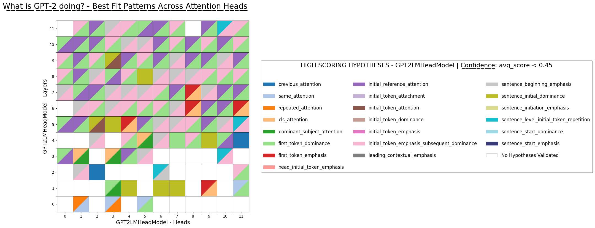
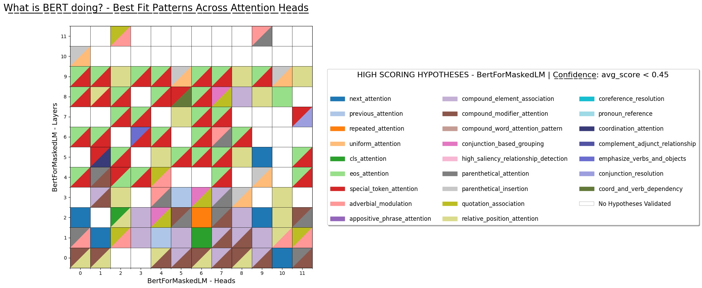

# LLM-Interpretability | Analyzing Attention Heads
### Author: Amiri Hayes

>[Link to my Poster](https://drive.google.com/file/d/1pJabwGFm6aaWH20wK8qmOcMiKy29-IiG/view?usp=drive_link) \
  [Link to my Report](https://drive.google.com/file/d/1h7wfQGjmjxRAEsa5HY0fxZ3_bT0ZXX3E/view?usp=drive_link) \
  [Python Library | ViewLLM](https://test.pypi.org/project/viewllm/) \
  [Additional Info](https://amirihayes.github.io/LLM-Interpretability/)

### Research Question

Primary research question - "Can attention heads be categorized into meaningful linguistic categories based on their role in the language modeling process?" (includes categories such as algorithmic, syntactic, semantic, dependency management, etc.) Then, what is the knowledge encoded within these heads: What factual knowledge, common sense, / linguistic rules (grammar, syntax, semantics) are encoded within their parameters?

### Idea

Main idea was to analyze attention heads against example heads that are known to encode interpretable patterns. Compare these heads based on objective scoring criteria, specifically the sum of absolute errors or Jensen-Shannon distance (JSD) to generate scores. If  example/interpretable heads can be effectively learned or identified, the automation pipeline implemented can help be a method of providing transparency for large language models.

### Code

Main analytical work is performed within `interpretability.ipynb`, which is structured into the following key sections:
* **Data & Pattern Initialization Functions:** Functions dedicated to loading data and initializing example/interpretable patterns
* **Analysis Helper Functions:** A collection of utility functions to assist in the quantitative analysis of attention head behaviors
* **Filter Automation Efforts:** Initial progress towards automating filtering and categorization of attention heads using scores

 
 
Two cool plots from my <b>Fall 2025</b> Experiments so far (Work-In-Progress):
 
 

